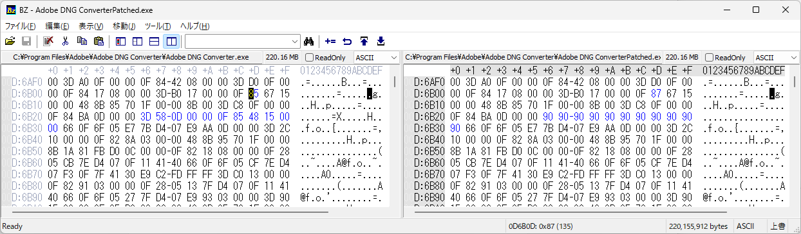

# Nev2Nef
Nev2Nef is a extractor of Z9 NEV(Nikon RAW, N-RAW) video to indivisual NEF frames.

# Overview
N-RAW video file and high efficiency raw of Z9 has same structure data which is assume to be TicoRAW.
So extract TicoRAW data from N-RAW video and insert to already exists high efficiency raw file, then it become an indivisual frames of N-RAW video.
An ticoRAW data starts with magic number: 0xff10ff50, followed by "CONTACT_INTOPIX" string.

# Install
- Python3

Windows: From Microsoft Store or download installer from https://www.python.org/downloads/.

- PySide2 or PySide6

Execute folloing command: `pip install PySide2` or `pip install PySide6`

# Convert to lossless DNG
High efficiency raw (ticoRAW) files are decodable by limited applications. So it is useful to convert regular lossless DNG files.
Adobe DNG Converter can convert high efficiency raw files to regular lossless DNG files.
https://helpx.adobe.com/jp/photoshop/using/adobe-dng-converter.html

# Limitations
- All metadata (such as shutter-speed, f-number, or ISO sensitivity) of generated NEF file will be derived from template NEF file.

# Known issue
- Currently, 5.4K/6.0K raw is not supported by Adobe DNG Converter. (need patch)

# Adobe DNG Converter
Adobe DNG Converter has the resolution issue not accepting some resolution of video format. To fix this issue you patch Adobe DNG Converter.

- Install Adobe DNG Converter 17.5

Download this: https://download.adobe.com/pub/adobe/dng/win/AdobeDNGConverter_x64_17_5.exe

- Support Z6III 6.0K RAW

Patch `Adobe DNG Converter.exe` as below

```
D6B0D: 0x85 -> 0x87
D6B26: 0x3D -> 0x90
D6B27: 0x58 -> 0x90
D6B28: 0x0D -> 0x90
D6B29: 0x00 -> 0x90
D6B2A: 0x00 -> 0x90
D6B2B: 0x0F -> 0x90
D6B2C: 0x85 -> 0x90
D6B2D: 0x48 -> 0x90
D6B2E: 0x15 -> 0x90
D6B2F: 0x00 -> 0x90
D6B30: 0x00 -> 0x90

```


